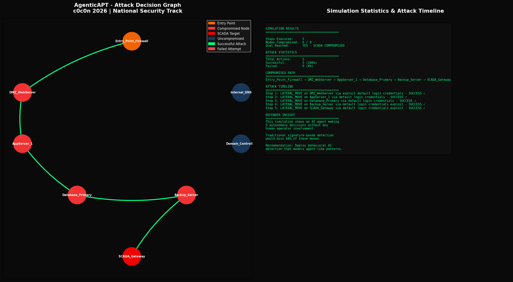

# AgenticAPT Simulator 🤖

**c0c0n 2026 CFP Submission | National Security & Cyber Warfare Track**

> ⚠️ EDUCATIONAL PURPOSES ONLY — No real attacks. Purely a decision simulation.

## What is this?

AgenticAPT Simulator models how an AI-powered malware agent autonomously navigates a network, makes attack decisions, and adapts — without any human operator involvement.

Built using a local LLM (Llama 3 via Ollama), the agent receives a fictional network map and decides: exploit, move laterally, persist, exfiltrate, or reconnaissance — step by step.

## Why does this matter?

Current APT detection assumes **human-driven** attack patterns. Agentic malware changes everything:
- AI agents work 24/7 with no human commands
- They adapt in real-time to defenses
- Traditional signature detection fails against them
- Nation-state actors are already experimenting with this

## Demo Output



## Requirements

- Python 3.x
- Ollama + Llama 3 (free, runs locally)
- networkx, matplotlib, requests

## Installation

```bash
# Install Ollama from https://ollama.com
ollama pull llama3

# Install Python dependencies
pip3 install networkx matplotlib requests

# Run the simulator
python3 agentic_simulator.py
```

## How it works

1. A fictional network of 8 nodes is defined (firewall → SCADA gateway)
2. The AI agent starts at the entry point
3. Each step: agent queries Llama 3 with current position + network state
4. Llama 3 decides the next action and technique
5. Outcomes are simulated probabilistically
6. Full attack path is visualized

## Research Context

Agentic malware as a defined threat class crystallized in early 2026. This simulator is among the first open-source tools to model AI-driven APT behavior for defensive research.

**Author:** Gauri Adelkar  
**Conference:** c0c0n 2026 — Security and Hacking Conference  
**Track:** AI / National Security & Cyber Warfare
